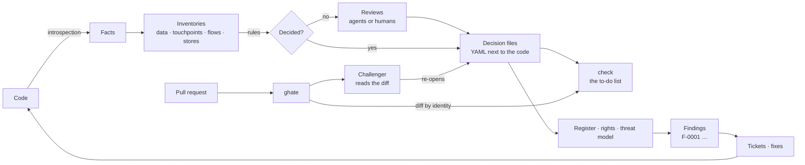

# The cycle

## The four inventories

| Inventory | Comes from | Decided by | Decision file |
|---|---|---|---|
| **Data items** — every field, column, JSON key, file content | model introspection | data rules, then a review per model | `data.lock.yaml`, `data/<id>.yaml` overrides |
| **Touchpoints** — routes, tasks, admin screens, front routes | URL conf, task registry, SvelteKit tree | a declaration per touchpoint: what it does to which items, for whom, sent where | `touchpoints/<slug>.yaml` |
| **Flows** — `source -> sink` movements | the two above | kind and status from the ends; undeclared ones reported | `undeclared:` in the manifest |
| **Stores** — databases, caches, buckets, queues | settings | one file per store | `stores/<slug>.yaml` |

From these the tool derives, without further input, the **activities**
(groups of touchpoints with a purpose and a legal basis), the **rights
coverage** (which of Art. 15–21 each item can be exercised through), and
the **threat matrix** (every element × every applicable threat).

## Who does what

| Actor | Does | Through |
|---|---|---|
| Introspection | produces the facts | `model-wtf` scripts run in the unit's own interpreter |
| Rules | decide what facts decide | `knowledge/` YAML shipped with the tool |
| Reviewer agents | answer one narrow question at a time, cite code | `auto-review` swarms; one write tool each |
| Developer | reads `check`, answers `!todo`, declares what changed | the CLI, the YAML files |
| Challenger agent | reads a PR's diff, re-opens undermined reviews | `ghate` in CI |
| DPO / CISO | own the decision files (CODEOWNERS), read the register and the findings | `activities explain`, `threats findings`, `check` |

## Life of a change

1. A developer opens a pull request.
2. `ghate` runs `check` on the base and on the head, in worktrees, and
   compares by finding identity. It also runs the challenger, which reads
   the diff and calls `challenge` on every declaration or stamp the change
   plausibly undermines; each challenge is a new finding on the head.
3. The PR fails on what it introduced — with the line, the file, and the
   command to run. Pre-existing findings are listed for information.
4. The developer answers: re-declares the touchpoint, reviews the new data
   item, re-stamps the threat cell (or turns it into a `!missing`), or
   declares the new transfer and its party. A re-review records `answered:`
   so the same doubt is not raised twice.
5. Merged, the decision files are the new base.

Nothing in this loop needs the agents to succeed: without an API key the
gate still fails on every deterministic finding (a new field, a host the
code calls with no declared party, a dropped auth wrapper).
